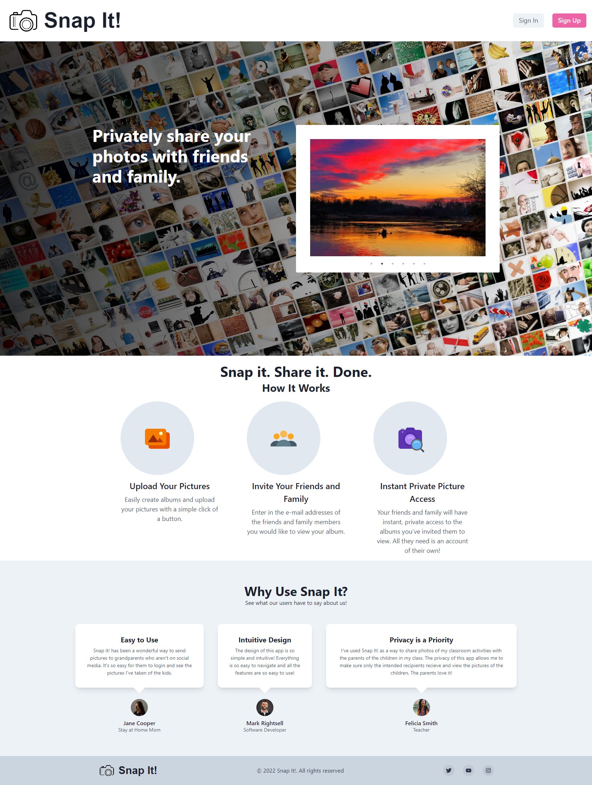

# Snap It!

## Table of Contents
- [Description](#description)
- [User Story](#user-story)
- [Mock-up](#mock-up)
- [Deployment](#deployment)
- [Installation](#installation)
- [Usage](#usage)
- [Tests](#tests)
- [Technologies](#technologies)
- [Contributor](#contributors)

## Description
Snap It! is a photo-album sharing website where users can create public or private albums to share with others.  Public albums will be available for viewing among all users, whereas private albums are only viewable by people on a user's friends list.  At the landing page, users will have the option to login or register for an account.  Once logged in or registered, they will be taken to a dashboard where their favorite albums will be loaded.  In a side bar will be their friends list.  If a user is new and has no albums listed as their favorites, a random assortment of public albums will appear on their dashboard.  All public albums will have the ability to be saved as a favorite. Private albums can only be viewed and saved as favorites by users listed as friends. Once an album is clicked, the photos in the album will be populated on a left hand side bar, with a close up of each image populated in the middle of the screen when the image in the side bar is clicked.  Once on an individual photo, there will be an option to comment on the photo. On a user's dashboard will also be the ability to create an album and upload pictures to the album. Once an album is created a user can set whether the album is public or private and which friends can see the album and also whether others can add images to the album.  For instance, a user may start a pets album with pictures of his pets but allow other users to share pictures of their pets in the public pets album.  Users could create albums for fashion, cars, home decor, or any other topic.  In addition, some users may use Snap It! to just share family albums with other friends and family in a more private forum than regular social media.  
## User Story

- As a socially active person and lover of photography I want to be able to share pictures of my life and things I enjoy. I can update and stay in touch with my friends and family on life events as well as share common interests with others.

## Installation
To start application install npm by entering the command ```npm install```  into the terminal. This will install all dependencies in the ```package.json```, in the root directory, required to run this application. At the server folder and client folder enter the command ```npm i``` into the terminal to install all dependencies in the ```package.json```, at each subfolder level. At the root directory enter the command ```npm run develop``` to start the application



## Tests


## Technologies


## Contributors

- Deon Cole || https://github.com/deoncole/deoncole-profile-page

- Erin Ewart || https://github.com/uncgirl02/erin-ewart-portfolio

- Ashley Lawrence || https://github.com/Chlovanna/The-Asset-Why-Not
